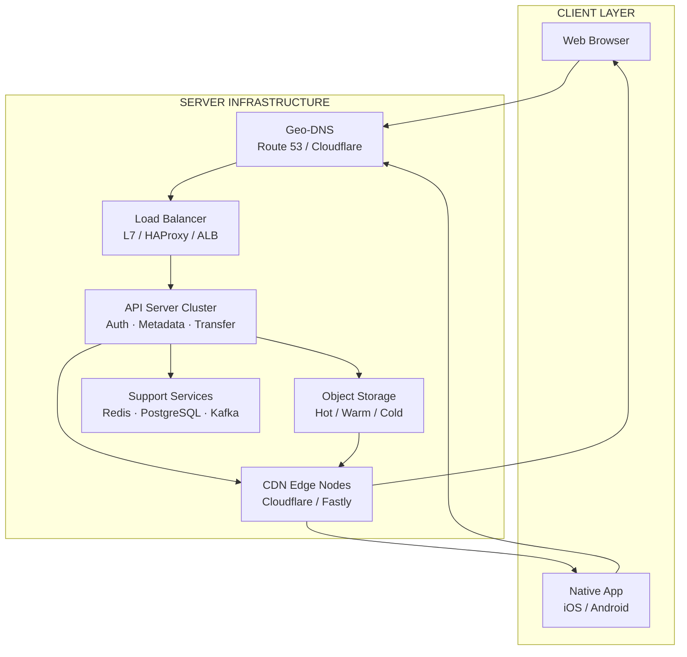

# Large-Scale File Transfer — Architecture Documentation

> สถาปัตยกรรมระบบดาวน์โหลดไฟล์ขนาดใหญ่แบบ End-to-End Encrypted  
> ครอบคลุมตั้งแต่ฝั่ง Server Infrastructure จนถึง Client-side Download Flow

---

## เอกสารในชุดนี้

| เอกสาร | คำอธิบาย | 
|---|---|---|
| [Server Infrastructure](./server-infrastructure.md) | Storage, CDN, Load Balancer, API Server, Security | 
| [Browser Download Flow](./browser-download-flow.md) | Chunking, Assembling, Local Save บน Web Browser | 
| [App Download Flow](./app-download-flow.md) | Native iOS / Android Download Flow | 

---

## ภาพรวมสถาปัตยกรรม

---

## Server Infrastructure

**[server-infrastructure.md](./server-infrastructure.md)**

ครอบคลุมทุก layer ของฝั่ง Server

- **Geo-DNS** — route user ไป region ที่ใกล้ที่สุด, regional failover
- **Load Balancer** — L7 routing, TLS termination, sticky session, rate limiting
- **API Layer** — Auth & Session, Metadata Service, Transfer Service, Resume State Service
- **Storage Layer** — Hot/Warm/Cold tiering, Object Storage, Erasure Coding, Deduplication (CAS)
- **CDN Layer** — Chunk caching, Signed URL, Anycast edge
- **Support Services** — Redis, PostgreSQL, Kafka, Garbage Collector, CDN Log Analysis (two-layer security)
- **Resume-ability** — Hybrid approach: Resume Token + Primary DB Fallback
- **Zero-Knowledge Design** — Server ไม่มีทางรู้เนื้อหาไฟล์
- **ADR** — บันทึกการตัดสินใจ Eventual Consistency และ Threat Detection

---

## Browser Download Flow

**[browser-download-flow.md](./browser-download-flow.md)**

ครอบคลุม client-side logic ทั้งหมดที่ทำงานใน Web Browser

- **Phase 0 — Session Gate** — Transfer Quota check, `storage.estimate()`, Exponential Backoff
- **Phase 1 — Chunking** — Wake Lock, Queue Manager (max 6 concurrent), HTTP Range fetch, SubtleCrypto decrypt, MAC verify
- **Phase 2 — Assembling** — RAM vs IndexedDB buffer, Progress Map, Resume Token, Primary Fallback
- **Phase 3 — Local Save** — File System Access API + Atomic Rename, Service Worker Stream + Backpressure, createObjectURL fallback
- **Cleanup** — Wake Lock release, IndexedDB clear, Worker terminate

---

## App Download Flow

**[app-download-flow.md](./app-download-flow.md)**

ครอบคลุม Native App (iOS / Android) ที่มีความสามารถต่างจาก Browser อย่างมีนัยสำคัญ

- **Phase 0 — Session Gate** — Quota check, OS disk space API (`volumeAvailableCapacity` / `StatFs`)
- **Phase 1 — Background Session** — `URLSession` background (iOS) / `WorkManager` (Android), `OperationQueue` / `ExecutorService`, `CryptoKit` / `javax.crypto`, MAC verify
- **Phase 2 — Assembling** — App sandbox filesystem, `CoreData` / `Room` progress DB, Resume Token via Deep Link / Push Notification
- **Phase 3 — Save to Device** — Atomic move (`FileManager.moveItem` / `File.renameTo`), push notification, Media Scanner (Android)
- **Background Edge Cases** — iOS handleEventsForBackgroundURLSession, Android Doze Mode, network change handling

---

## Key Design Principles

**Zero-Knowledge**
Server เก็บเฉพาะ ciphertext ไม่มีทางรู้เนื้อหาไฟล์ File Key อยู่ใน browser/app ของ user เท่านั้น

**Resumable by Design**
ทุก chunk มี MAC เป็น identity Progress Map บันทึกทุก chunk ที่ผ่าน verify แล้ว ทำให้ resume ได้ทุกจุดโดยไม่ต้องโหลดซ้ำ

**Backpressure at Every Layer**
ทั้ง Queue Manager (ฝั่ง fetch) และ WritableStream (ฝั่ง save) มีกลไก backpressure ป้องกัน RAM บวมไม่ว่าไฟล์จะใหญ่แค่ไหน

**Two-Layer Security**
Edge Rate Limiter จัดการ immediate threat ใน millisecond ส่วน Flink stream processor จัดการ sophisticated pattern เช่น low-and-slow attack ที่ต้องการ context กว้างกว่า

**Tiered Storage**
Hot/Warm/Cold migration อัตโนมัติตาม access pattern ทำให้ cost เป็น proportional กับการใช้งานจริง ไม่จ่าย NVMe ราคาสำหรับไฟล์ที่ไม่มีใครเปิดนาน 90 วัน
