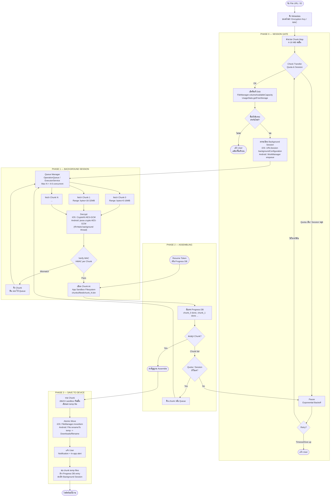

# Large-Scale App Download Flow

> Chunked · Parallel · Background-capable · OS-managed Save  
> สถาปัตยกรรมการดาวน์โหลดไฟล์ขนาดใหญ่บน Native App (iOS / Android)

---

## เปรียบเทียบกับ Browser Flow

| จุด | Browser | Native App |
|---|---|---|
| Background Download | ไม่ได้ ต้องเปิด tab ค้างไว้ | ได้ — OS จัดการให้ |
| Chunk Storage | IndexedDB | App sandbox filesystem |
| Crypto | `SubtleCrypto` (Web API) | `CommonCrypto` (iOS) / `javax.crypto` (Android) |
| Concurrency Control | `p-limit` / custom pool | `OperationQueue` (iOS) / `ExecutorService` (Android) |
| Wake Lock | `Wake Lock API` (screen) | ไม่จำเป็น OS จัดการ background process |
| Save File | File System Access API / Blob | เขียนลง Downloads folder โดยตรง |
| Resume Token delivery | QR Code / share link | Deep link / Push Notification |
| Service Worker | ใช้แทน native stream | ไม่มี ไม่จำเป็น |
| Atomic Write | `writer.close()` -> OS rename | `FileManager.moveItem()` (iOS) / `File.renameTo()` (Android) |

---

## Tech Stack

| Layer | iOS | Android |
|---|---|---|
| Background Download | `URLSession` + `BackgroundConfiguration` | `WorkManager` + `CoroutineWorker` |
| HTTP Range Fetch | `URLRequest` + `Range` header | `OkHttp` + `Range` header |
| Concurrency | `OperationQueue` (max 4-6) | `ExecutorService` / `Dispatchers.IO` |
| Chunk Storage | `FileManager` — app sandbox | `File` — app-specific external storage |
| Crypto | `CommonCrypto` / `CryptoKit` (AES-GCM) | `javax.crypto` (AES-GCM) |
| MAC Verify | `CryptoKit.HMAC` | `javax.crypto.Mac` |
| Progress Persistence | `UserDefaults` / `CoreData` | `Room Database` / `SharedPreferences` |
| Resume Token | Deep Link (`myapp://resume?token=...`) | Deep Link + Firebase Dynamic Link |
| Push Notification | APNs | FCM |
| Atomic Save | `FileManager.moveItem(at:to:)` | `File.renameTo()` |

---

## Diagram



---

## Phase 0 — Session Gate

### Check Transfer Quota & Session

ทำงานเหมือน Browser Flow ทุกประการ ระบบใช้ Transfer Quota แบบ IP-based พร้อม Exponential Backoff

```
ครั้งที่ 1  ->  รอ 30s
ครั้งที่ 2  ->  รอ 60s
ครั้งที่ N  ->  รอ min(2^N x 15s, MAX_WAIT)
```

### ตรวจสอบพื้นที่ Disk

แทนที่จะใช้ `navigator.storage.estimate()` ใช้ OS API โดยตรง

**iOS**
```swift
let systemAttributes = try FileManager.default.attributesOfFileSystem(
    forPath: NSHomeDirectory()
)
let freeSpace = systemAttributes[.systemFreeSize] as? Int64 ?? 0

if freeSpace < fileSize {
    // แจ้ง user ให้เคลียร์พื้นที่
}
```

**Android**
```kotlin
val stat = StatFs(Environment.getDataDirectory().path)
val freeBytes = stat.availableBlocksLong * stat.blockSizeLong

if (freeBytes < fileSize) {
    // แจ้ง user ให้เคลียร์พื้นที่
}
```

---

## Phase 1 — Background Session

นี่คือความแตกต่างที่ใหญ่ที่สุดจาก Browser Flow — Native App โหลดต่อได้แม้ user ปิด app หรือล็อกหน้าจอ

### iOS — URLSession Background Configuration

```swift
let config = URLSessionConfiguration.background(
    withIdentifier: "com.app.download.\(fileId)"
)
config.isDiscretionary = false        // โหลดทันที ไม่รอ discretionary window
config.sessionSendsLaunchEvents = true // iOS wake app ขึ้นมาเมื่อโหลดเสร็จ

let session = URLSession(
    configuration: config,
    delegate: self,
    delegateQueue: nil
)
```

เมื่อ user ปิด app iOS จะโหลดต่อ background แล้ว wake app ขึ้นมาใน `application(_:handleEventsForBackgroundURLSession:)` เพื่อ process chunk ที่โหลดมา

```
user ปิด app
      |
      | iOS background session ทำงานต่อ
      v
chunk โหลดเสร็จ -> iOS wake app ขึ้นมา
      |
AppDelegate.handleEventsForBackgroundURLSession
      |
decrypt + verify MAC + เขียนลง sandbox
      |
update Progress DB -> ดับ app อีกรอบถ้าไม่มีงานค้าง
```

**ข้อจำกัด: iOS ควบคุม Concurrency เอง**

`URLSessionConfiguration.background` มี scheduler ของ iOS เองที่ตัดสินใจจำนวน parallel connection ตามสถานะแบตเตอรี่และอุณหภูมิเครื่อง การตั้ง `OperationQueue.maxConcurrentOperationCount` ไปคุมทับจะขัดแย้งกับ scheduler นี้

```
ห้ามทำ:
  let queue = OperationQueue()
  queue.maxConcurrentOperationCount = 4  // ขัดแย้งกับ iOS background scheduler

ที่ถูกต้อง:
  ปล่อยให้ iOS จัดการ parallel connection เอง
  เตรียม handleEventsForBackgroundURLSession ให้สมบูรณ์
  ทุกครั้งที่ chunk เสร็จ -> process ทันทีใน delegate callback
```

`OperationQueue` ยังใช้ได้สำหรับ **foreground** download (เมื่อ app อยู่หน้าจอ) แต่เมื่อ app เข้า background ต้อง handoff ให้ background session ดูแลต่อ

### Android — WorkManager

```kotlin
val downloadRequest = PeriodicWorkRequestBuilder<DownloadWorker>(
    repeatInterval = 15, TimeUnit.MINUTES
)
.setConstraints(
    Constraints.Builder()
        .setRequiredNetworkType(NetworkType.CONNECTED)
        .build()
)
.setInputData(
    workDataOf(
        "fileId" to fileId,
        "chunkIndex" to nextPendingChunk
    )
)
.build()

WorkManager.getInstance(context).enqueueUniquePeriodicWork(
    "download_$fileId",
    ExistingPeriodicWorkPolicy.KEEP,
    downloadRequest
)
```

WorkManager รับประกัน execution แม้ app ถูก kill หรือเครื่อง restart ระบบ OS จะ schedule งานใหม่ให้อัตโนมัติ

### Queue Manager

ทำงานเหมือน Browser แต่ใช้ native concurrency primitive

```
iOS:
  let queue = OperationQueue()
  queue.maxConcurrentOperationCount = 4

Android:
  val executor = Executors.newFixedThreadPool(4)
  // หรือ Kotlin Coroutines:
  withContext(Dispatchers.IO.limitedParallelism(4)) { ... }
```

### Crypto — ไม่ต้องใช้ Worker Thread แยก

บน Native App crypto library รันบน background thread โดยตรงผ่าน OS thread pool ต่างจาก Browser ที่ต้องส่ง message ข้าม Web Worker

**iOS — CryptoKit**
```swift
let sealedBox = try AES.GCM.SealedBox(combined: encryptedChunk)
let decrypted = try AES.GCM.open(sealedBox, using: fileKey)
let mac = HMAC<SHA256>.authenticationCode(for: decrypted, using: macKey)
guard mac == expectedMac else { throw DownloadError.macMismatch }
```

**Android — javax.crypto**
```kotlin
val cipher = Cipher.getInstance("AES/GCM/NoPadding")
cipher.init(Cipher.DECRYPT_MODE, secretKey, GCMParameterSpec(128, iv))
val decrypted = cipher.doFinal(encryptedChunk)
val mac = Mac.getInstance("HmacSHA256")
mac.init(macKey)
check(mac.doFinal(decrypted).contentEquals(expectedMac)) { "MAC mismatch" }
```

---

## Phase 2 — Assembling

### Chunk Storage — App Sandbox Filesystem

แทนที่จะใช้ IndexedDB เขียน chunk ลงไฟล์จริงใน sandbox โดยตรง เร็วกว่าและไม่มี size limit เหมือน IndexedDB

```
iOS sandbox:
  <App>/Library/Caches/downloads/{fileId}/chunk_0.bin
  <App>/Library/Caches/downloads/{fileId}/chunk_1.bin
  ...

Android sandbox:
  /data/user/0/{packageName}/cache/downloads/{fileId}/chunk_0.bin
  ...
```

ใช้ `Caches` directory เพื่อให้ OS สามารถ purge ได้อัตโนมัติถ้า disk เต็ม แต่ต้องรองรับกรณีที่ OS purge chunk ออกไปกลางทาง (ดู Cache Resilience ด้านล่าง)

### Cache Resilience — Physical File Verification

OS สามารถลบไฟล์ใน `Caches` ได้ทุกเมื่อเมื่อ disk pressure สูง ทำให้ Bitmask ใน Progress DB บอกว่า "เสร็จ" แต่ไฟล์จริงหายไปแล้ว ก่อนเริ่ม Assemble ต้องตรวจสอบไฟล์จริงทุกครั้ง

```
เริ่ม Assemble:
      |
      | วน loop ทุก chunk ที่ Bitmask = done
      v
ตรวจว่าไฟล์ chunk_N.bin ยังมีอยู่จริงไหม?
      |
      |-- มีอยู่  -> ใช้ได้ ดำเนินการต่อ
      |
      |-- หายไป  -> แก้ Bitmask กลับเป็น pending
                    เพิ่ม chunk_N กลับเข้า Queue
                    โหลดใหม่ก่อน Assemble
```

**iOS**
```swift
func validateChunks(fileId: String, session: DownloadSession) -> [Int] {
    var missingChunks: [Int] = []
    for index in session.completedIndices {
        let chunkURL = chunkDir.appendingPathComponent("chunk_\(index).bin")
        if !FileManager.default.fileExists(atPath: chunkURL.path) {
            missingChunks.append(index)
            session.markChunkPending(index)   // แก้ bitmask
        }
    }
    return missingChunks  // re-download เหล่านี้ก่อน
}
```

**Android**
```kotlin
fun validateChunks(fileId: String, session: DownloadSession): List<Int> {
    return session.completedIndices.filter { index ->
        val chunkFile = File(chunkDir, "chunk_$index.bin")
        if (!chunkFile.exists()) {
            session.markChunkPending(index)   // แก้ bitmask ใน Room
            true
        } else false
    }
}
```

### Progress Persistence

**iOS — CoreData / UserDefaults**
```swift
// UserDefaults สำหรับ lightweight state
UserDefaults.standard.set(completedChunks, forKey: "dl_\(fileId)")

// CoreData สำหรับ production
let session = DownloadSession(context: context)
session.fileId = fileId
session.completedMask = bitmask
session.lastActive = Date()
try context.save()
```

**Android — Room Database**
```kotlin
@Entity
data class DownloadSession(
    @PrimaryKey val fileId: String,
    val completedMask: ByteArray,
    val totalChunks: Int,
    val lastActive: Long,
    val expiresAt: Long
)
```

### Resume-ability

ทำงานเหมือน Browser Hybrid Approach แต่ delivery mechanism ต่างกัน

**Resume บน Device เดิม**

```
App เปิดขึ้นมาใหม่
      |
      | อ่าน Progress DB (CoreData / Room)
      v
ได้ completedChunks -> สร้าง Queue เฉพาะ chunk ที่ยังไม่เสร็จ
      |
      | Background Session ทำงานต่อ
      v
โหลดต่อจากจุดที่ค้างได้ทันที
```

**Resume ข้าม Device — Deep Link**

```
Device A โหลดไปได้ 40% -> สร้าง Resume Token
      |
      | แชร์ผ่าน Deep Link:
      | myapp://resume?token=eyJ...
      | หรือส่งผ่าน Push Notification
      v
Device B กด link -> app เปิดด้วย token
      |
AppDelegate / Activity รับ URL
      |
decode token -> ได้ completedChunks ทันที
      |
Background Session เริ่มโหลด 60% ที่เหลือ
```

**Primary Fallback** ทำงานเหมือน Browser Flow ทุกประการ

---

## Phase 3 — Save to Device

### Partial Verification ระหว่าง Assemble

สำหรับไฟล์ขนาด 50GB+ การรอ assemble ทั้งหมดก่อนตรวจสอบ integrity อาจใช้เวลาและทรัพยากรสูงมาก ระบบควรตรวจสอบแบบ append-as-you-go แทน

```
แทนที่จะ:
  โหลดครบ -> รวมทั้งหมด -> ตรวจ integrity

ใช้:
  โหลด chunk_N -> verify MAC -> append ลง temp file ทันที
                                         |
                                         | ตรวจ temp file size
                                         | หลังทุก 100 chunk
                                         v
                                  ถ้า size ไม่ตรงที่คำนวณไว้
                                  -> หา chunk ที่ผิดพลาด -> re-download
```

การ append ทีละ chunk ยังช่วยให้ `Atomic Move` ท้ายสุดเร็วขึ้นด้วย เพราะ temp file ถูกสร้างไว้แล้วระหว่างโหลด ไม่ต้องรวมทีเดียวตอนจบ

### Atomic Move

**iOS**
```swift
let tempURL = cacheDir.appendingPathComponent("\(fileId).tmp")
let outputStream = OutputStream(url: tempURL, append: true)!
outputStream.open()

for chunkIndex in 0..<totalChunks {
    let chunkURL = chunkDir.appendingPathComponent("chunk_\(chunkIndex).bin")
    let chunkData = try Data(contentsOf: chunkURL)
    chunkData.withUnsafeBytes { ptr in
        outputStream.write(ptr.baseAddress!, maxLength: chunkData.count)
    }
}
outputStream.close()

let destURL = downloadsDir.appendingPathComponent(filename)
try FileManager.default.moveItem(at: tempURL, to: destURL)
```

**Android — Scoped Storage (Android 10+)**

Android 10+ บังคับใช้ Scoped Storage ไม่สามารถเขียนตรงไปที่ `Environment.DIRECTORY_DOWNLOADS` ผ่าน `File` API ได้อีกต่อไป ต้องใช้ `MediaStore` API แทนตั้งแต่ต้น เพื่อเลี่ยงปัญหา permission เมื่อย้ายไฟล์ออกจาก sandbox

```kotlin
// Android 10+ — เขียนผ่าน MediaStore โดยตรง ไม่ต้องย้ายไฟล์ทีหลัง
val contentValues = ContentValues().apply {
    put(MediaStore.Downloads.DISPLAY_NAME, filename)
    put(MediaStore.Downloads.MIME_TYPE, mimeType)
    put(MediaStore.Downloads.IS_PENDING, 1)   // ซ่อนไฟล์จาก user ระหว่างเขียน
}

val resolver = context.contentResolver
val uri = resolver.insert(
    MediaStore.Downloads.EXTERNAL_CONTENT_URI,
    contentValues
)!!

resolver.openOutputStream(uri)!!.use { outputStream ->
    (0 until totalChunks).forEach { index ->
        val chunkFile = File(chunkDir, "chunk_$index.bin")
        outputStream.write(chunkFile.readBytes())
    }
}

// เปิดให้ user เห็นหลังเขียนเสร็จ (เทียบเท่า Atomic Rename)
contentValues.clear()
contentValues.put(MediaStore.Downloads.IS_PENDING, 0)
resolver.update(uri, contentValues, null, null)
```

`IS_PENDING = 1` ทำหน้าที่เหมือน temp file — ซ่อนไฟล์ไม่ให้ user เห็นระหว่างเขียน เมื่อ set เป็น `0` จึงปรากฏใน Downloads ทันที ไม่ต้องเรียก `MediaScannerConnection` เพิ่มเติม

### แจ้ง User

```
iOS:
  UNUserNotificationCenter.current().add(
      UNNotificationRequest(
          identifier: fileId,
          content: content,   // "ดาวน์โหลด filename เสร็จแล้ว"
          trigger: nil        // แสดงทันที
      )
  )

Android:
  NotificationManagerCompat.from(context).notify(
      notificationId,
      NotificationCompat.Builder(context, CHANNEL_ID)
          .setContentTitle("ดาวน์โหลดเสร็จแล้ว")
          .setContentText(filename)
          .build()
  )
```

### Cleanup

```swift
// iOS
try FileManager.default.removeItem(at: chunkDir)      // ลบ chunk temp files
CoreDataStack.shared.deleteSession(fileId: fileId)    // ล้าง Progress DB
session.invalidateAndCancel()                          // ยกเลิก Background Session
```

```kotlin
// Android
chunkDir.deleteRecursively()                           // ลบ chunk temp files
database.downloadSessionDao().delete(fileId)           // ล้าง Room DB entry
WorkManager.getInstance(context).cancelUniqueWork(     // ยกเลิก WorkManager job
    "download_$fileId"
)
```

---

## Download Policy Manager

Native App แตกต่างจาก Browser ตรงที่ user คาดหวังว่าจะควบคุมการโหลดได้ เช่น ให้โหลดเฉพาะตอนต่อ WiFi หรือตอนชาร์จแบตเท่านั้น

### iOS — URLSessionConfiguration

```swift
var config = URLSessionConfiguration.background(
    withIdentifier: "com.app.download.\(fileId)"
)

// WiFi only
config.allowsCellularAccess = !userPrefs.wifiOnly

// ถ้า user เลือก "โหลดเฉพาะตอนชาร์จ"
// ใช้ isDiscretionary = true -> iOS จะเลือกเวลาที่เหมาะสมเอง
config.isDiscretionary = userPrefs.chargingOnly
```

### Android — WorkManager Constraints

```kotlin
val constraints = Constraints.Builder()
    .setRequiredNetworkType(
        if (userPrefs.wifiOnly) NetworkType.UNMETERED   // WiFi / Ethernet เท่านั้น
        else NetworkType.CONNECTED                       // ทุก network
    )
    .apply {
        if (userPrefs.chargingOnly) {
            setRequiresCharging(true)
        }
    }
    .build()
```

### UI — Download Settings

ควรมี toggle ให้ user ตั้งค่าได้ก่อนเริ่มโหลด และเปลี่ยนระหว่างโหลดได้ด้วย

```
Settings:
  [ ] โหลดเฉพาะเมื่อต่อ WiFi
  [ ] โหลดเฉพาะเมื่อชาร์จแบต
  [ ] หยุดชั่วคราวเมื่อแบตต่ำกว่า 20%
```

เมื่อ user เปลี่ยน policy ระหว่างโหลด ระบบต้องยกเลิก WorkManager/URLSession ที่รันอยู่แล้ว re-enqueue ด้วย Constraints ใหม่ ส่วน Progress ที่โหลดไปแล้วไม่หาย เพราะ Bitmask ยังอยู่ใน DB

---

### iOS App Killed by OS

ถ้า OS kill app กลางคันเพราะ memory pressure Background URLSession ยังทำงานต่อ เมื่อ chunk โหลดเสร็จ iOS จะ launch app ขึ้นมาใหม่ใน background เพื่อ process

```
OS kill app (memory pressure)
      |
      | Background URLSession ยังโหลดต่อใน iOS daemon
      v
chunk โหลดเสร็จ
      |
iOS launch app ใหม่แบบ background
      |
application(_:handleEventsForBackgroundURLSession:completionHandler:)
      |
reconstruct session object -> process pending chunks
      |
เรียก completionHandler() -> iOS suspend app อีกครั้ง
```

ต้องเก็บ `completionHandler` ไว้ใน AppDelegate และเรียกหลัง process เสร็จเสมอ มิฉะนั้น iOS จะ watchdog terminate app

### Android Doze Mode

Android 6+ มี Doze Mode ที่จำกัด network access เมื่อเครื่องไม่ได้ใช้งาน WorkManager รองรับอยู่แล้วผ่าน Constraints

```kotlin
Constraints.Builder()
    .setRequiredNetworkType(NetworkType.CONNECTED)
    // WorkManager จะรอให้ออกจาก Doze window แล้วค่อย execute
    .build()
```

สำหรับ use case ที่ต้องการโหลดแม้อยู่ใน Doze ต้องขอ `REQUEST_IGNORE_BATTERY_OPTIMIZATIONS` permission แต่ Google Play policy มีข้อจำกัดสำหรับ permission นี้

### Network Change กลางทาง

เมื่อ network เปลี่ยน (WiFi -> Cellular หรือ reconnect) chunk ที่กำลังโหลดค้างอยู่ถือว่า fail ให้คืน slot กลับ Queue แล้ว retry ผ่าน Session Gate ตามปกติ

```
iOS: URLSession จัดการ reconnect อัตโนมัติ
     ถ้า fail ด้วย error code network -> retry chunk นั้น

Android: WorkManager retry เมื่อ network พร้อม
         ผ่าน Constraints.CONNECTED
```

---

## สรุป Key Concepts

| Concept | ปัญหาที่แก้ | วิธีแก้ (iOS / Android) |
|---|---|---|
| Background Download | app ปิดแล้วโหลดหยุด | `URLSession` background / `WorkManager` |
| iOS Background Concurrency | `OperationQueue` ขัดแย้งกับ iOS scheduler | ปล่อยให้ OS จัดการ parallel connection เอง |
| OS-managed Wake | เครื่อง sleep ตัด network | OS จัดการให้ ไม่ต้อง Wake Lock |
| Sandbox Filesystem | IndexedDB size limit | เขียน chunk ลง `Caches` directory โดยตรง |
| Cache Resilience | OS purge chunk กลางทาง | ตรวจ physical file ก่อน assemble -> re-download ถ้าหาย |
| Native Crypto | dependency บน Web API | `CryptoKit` / `javax.crypto` บน background thread |
| CoreData / Room | progress หายถ้า app crash | persistent DB บันทึกทุก chunk ที่เสร็จ |
| Deep Link Token | ข้าม device ต้องรอ DB sync | `myapp://resume?token=...` encode bitmask ใน token |
| Push Notification | user ไม่รู้ว่าโหลดเสร็จ | APNs / FCM แจ้งเมื่อ assemble เสร็จ |
| Partial Verification | ไฟล์ใหญ่ตรวจ integrity ช้ามาก | verify MAC + append ทีละ chunk ระหว่างโหลด |
| Atomic Move (iOS) | ไฟล์เสียถ้า app crash กลางรวม | `FileManager.moveItem` |
| Scoped Storage (Android 10+) | permission error ตอนย้ายไฟล์ไป Downloads | `MediaStore` + `IS_PENDING` ตั้งแต่ต้น |
| Download Policy Manager | user ไม่มีทางควบคุม WiFi / charging | `allowsCellularAccess` / `WorkManager Constraints` + UI toggle |
| handleEventsForBackgroundURLSession | iOS kill app กลาง session | AppDelegate รับ event -> process -> เรียก completionHandler |
| WorkManager Constraints | Android Doze Mode | `setRequiredNetworkType(CONNECTED)` |
| Exponential Backoff | Quota หมด / session หลุดกลางทาง | Pause -> retry พร้อม delay เพิ่มขึ้น |
