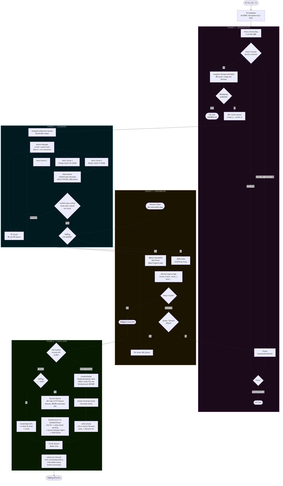

# Large-Scale Browser Download Flow

> Chunked · Parallel · In-Browser Assembly · Local Save  
> สถาปัตยกรรมการดาวน์โหลดไฟล์ขนาดใหญ่ผ่าน Browser โดยไม่ผ่าน Native Download Manager

---

## Tech Stack

| Layer | Technology | หมายเหตุ |
|---|---|---|
| Parallel Fetch | `fetch()` + HTTP Range Request | `Range: bytes=X-Y` |
| Concurrency Control | `p-limit` / custom pool | จำกัด Max N concurrent |
| Decrypt & Verify | Web Crypto API (`SubtleCrypto`) | Native browser, ไม่ต้องใช้ lib ภายนอก |
| Buffer เล็ก < 500MB | `Uint8Array[]` ใน RAM | เร็ว แต่กินหน่วยความจำ |
| Buffer ใหญ่ > 500MB | `IndexedDB` via `idb-keyval` | Persistent ระหว่างโหลด |
| Resume State (local) | `IndexedDB` | เก็บ progress map ระหว่าง session |
| Resume Token (cross-device) | Signed JWT ใน QR / share link | ข้าม device ได้ทันทีโดยไม่ต้อง query DB |
| Wake Lock | `Wake Lock API` | ป้องกันเครื่อง sleep ระหว่างโหลด |
| Save — Modern Browser | `File System Access API` + Atomic Rename | เขียน stream ลง disk โดยตรง |
| Save — Fallback ไฟล์ใหญ่ | `StreamSaver.js` + Service Worker | Fake HTTP Stream ไม่บวม RAM |
| Save — Fallback ไฟล์เล็ก | `URL.createObjectURL()` + `<a download>` | ง่ายสุด ใช้ได้ทุก Browser |

---

## Diagram



---

## Phase 0 — Session Gate

ทำงานก่อนเริ่ม fetch ทุกครั้ง รวมถึงตอน retry chunk กลางทาง

### Check Transfer Quota & Session

ระบบใช้ Transfer Quota แบบ IP-based ถ้าโหลดเกินโควต้าระหว่างทาง ระบบจะ pause แล้วใช้ **Exponential Backoff** รอจนกว่าจะโหลดต่อได้

```
ครั้งที่ 1  ->  รอ 30s
ครั้งที่ 2  ->  รอ 60s
ครั้งที่ 3  ->  รอ 120s
ครั้งที่ N  ->  รอ min(2^N x 15s, MAX_WAIT)
```

ถ้า retry เกินกำหนด -> แจ้ง user และหยุดกระบวนการ

### Storage Estimate

เช็คพื้นที่ IndexedDB ก่อนเริ่ม Phase 1 เพราะรู้ขนาดไฟล์จาก Metadata แล้ว

```js
const { quota, usage } = await navigator.storage.estimate();
const free = quota - usage;

if (free < fileSize) {
  // แจ้ง user ให้เคลียร์พื้นที่ก่อน
}
```

Browser จัดสรร storage ประมาณ 50–80% ของ disk ที่เหลืออยู่ ถ้าไม่เช็คก่อน อาจโหลดมาครึ่งทางแล้วค้างกลางอากาศ

---

## Phase 1 — Chunking

### Wake Lock

เรียก Wake Lock ทันทีที่เริ่ม Phase 1 ก่อนยิง fetch ชุดแรก

```js
let wakeLock = null;

try {
  wakeLock = await navigator.wakeLock.request('screen');
} catch (err) {
  // API ไม่รองรับหรือ user ปฏิเสธ — ดาวน์โหลดต่อได้แต่เสี่ยง sleep
}
```

บนแล็ปท็อปที่โหลดไฟล์ขนาด 50GB+ ถ้าไม่ lock screen OS จะสั่ง sleep และตัด network connection ทำให้ fetch ทุก slot ล้มเหลวพร้อมกัน Wake Lock จะถูก release ใน Cleanup หลังโหลดเสร็จ

### สร้าง Chunk Map

```
ขนาดไฟล์  : 1,024 MB
Chunk size : 16 MB
จำนวน chunk: 64 ชิ้น (chunk_0 ถึง chunk_63)

chunk_0   ->  Range: bytes=0-16777215
chunk_1   ->  Range: bytes=16777216-33554431
...
chunk_63  ->  Range: bytes=1056964608-1073741823
```

### Queue Manager

Browser มี hard limit ประมาณ **6 concurrent connections ต่อ domain** (HTTP/1.1) Queue Manager ทำหน้าที่เป็น token bucket ป้องกันไม่ให้ถล่ม server

```
Chunk Queue  : [0, 1, 2, 3, 4, 5, 6, 7, 8, ...]
                 | ดึงออกมาทีละ N (เช่น 4)
Active Slots : [fetch_0, fetch_1, fetch_2, fetch_3]
                 | พอ slot ไหนเสร็จ -> ดึง chunk ถัดไปทันที
Active Slots : [fetch_4, fetch_1, fetch_2, fetch_3]
```

- Retry กลับ Queue ไม่ใช่ retry ทันที -> ป้องกัน thundering herd ตอน chunk fail พร้อมกัน
- ถ้า fail ซ้ำ -> backoff delay ก่อนคืน slot

### SubtleCrypto

`window.crypto.subtle` รันที่ระดับ Native Browser (C++) ต่างจาก Pure JS lib อย่าง `aes-js` ที่ทำทุกอย่างใน JS Engine

| | Pure JS lib | `SubtleCrypto` |
|---|---|---|
| ความเร็ว | ~50–100 MB/s | ~300–800 MB/s |
| Hardware Acceleration | ไม่มี | มี (บางเครื่อง) |
| บล็อก Main Thread | ใช่ ถ้าไม่ใช้ Worker | ไม่ ใช้ Worker |
| ต้องโหลด lib เพิ่ม | ใช่ | ไม่ built-in |

### MAC Verification

หลัง decrypt แต่ละ chunk -> verify MAC 128-bit เทียบกับค่าใน Metadata

```
Metadata: { mac_0: "a3f9...", mac_1: "9b2c...", ... }

decrypt(chunk_0)  ->  คำนวณ MAC  ->  เทียบกับ mac_0
  ตรง    ->  ส่งไป Phase 2
  ไม่ตรง ->  ทิ้ง chunk ทันที -> คืน slot -> re-fetch
```

ป้องกันทั้ง data corruption ระหว่างทาง และ MITM attack ไม่มีทางเขียน chunk เสียลง IndexedDB ได้

---

## Phase 2 — Assembling

### เลือก Storage ตามขนาดไฟล์

| ขนาดไฟล์ | Storage | เหตุผล |
|---|---|---|
| < 500 MB | RAM (`Uint8Array[]`) | เร็วกว่า ไม่ต้อง I/O |
| >= 500 MB | IndexedDB | ป้องกัน RAM เต็ม Browser crash |

### Progress Map

```js
const progress = {
  chunk_0: "done",
  chunk_1: "done",
  chunk_2: "pending",
  chunk_3: "fetching",
  // ...
}
```

บันทึกลง IndexedDB ทุกครั้งที่ chunk ผ่าน MAC verify ใช้เป็น basis ของ Resume ทั้งใน session เดิมและ session ใหม่

### Retry Loop

ถ้า chunk fail ระหว่าง assembling -> เช็ค Session Gate ก่อนเสมอ เพราะอาจเป็นโควต้าหมดไม่ใช่ network error

### Resume-ability

รองรับสองกรณี คือ browser ปิดกลางทางบนเครื่องเดิม และการย้ายไปโหลดต่อบนเครื่องใหม่

**Resume บนเครื่องเดิม (IndexedDB)**

```
เปิด browser กลับมาใหม่
      |
      | อ่าน dl_state จาก IndexedDB
      v
ได้ completedChunks  ->  สร้าง Queue เฉพาะ chunk ที่ยังไม่เสร็จ
      |
      | เริ่ม fetch เฉพาะส่วนที่ค้างอยู่
      v
Queue Manager ทำงานต่อตามปกติ
```

**Resume ข้ามเครื่อง (Resume Token)**

Resume Token คือ signed JWT ที่ encode bitmask ของ completedChunks ไว้ใน token โดยตรง device ใหม่ไม่ต้องรอ DB sync เลย

```js
// โครงสร้าง Resume Token payload
{
  fileId:         "abc123",
  completedMask:  "base64-encoded-bitmask",
  totalChunks:    6400,
  exp:            1710086400   // หมดอายุใน 7 วัน
}
// sign ด้วย user's session key บน client
```

```
Device A โหลดไปได้ 40% -> สร้าง Resume Token -> แสดง QR / share link
      |
Device B สแกน QR หรือกดลิงก์
      |
decode token -> ได้ completedChunks ทันที (ไม่ query DB)
      |
สร้าง Chunk Queue เฉพาะ 60% ที่เหลือ -> โหลดต่อได้เลย
```

**Primary Fallback (กรณีไม่มี Token)**

ถ้าเข้าผ่าน URL ปกติบนเครื่องใหม่โดยไม่มี token ระบบ query Read Replica ก่อน ถ้าไม่พบเพราะ replica lag ให้ retry ไปที่ Primary DB อีกหนึ่งครั้ง

```
query Read Replica
      |
      |-- พบ session  -> ใช้ completedChunks ต่อได้เลย
      |
      |-- ไม่พบ       -> retry Primary DB
                              |
                              |-- พบ    -> ใช้ได้
                              |-- ไม่พบ -> completedChunks = []
                                          (โหลดใหม่ทั้งหมด)
```

---

## Phase 3 — Local Save

### เส้นทาง A — File System Access API (Modern Browser)

```
createWritable({ keepExistingData: false })
        |
   เขียนลง Temp File (OS จัดการ path ชั่วคราว)
        |
   await writer.write(chunk) x N   <- Backpressure อัตโนมัติ
        |
   writer.close()
        |
   OS: rename(temp -> filename)    <- Atomic
```

**Atomic Rename** คือการที่ OS ย้ายไฟล์จาก temp ไปที่จริงในคำสั่งเดียว ซึ่งเป็น atomic operation ระดับ filesystem

- ไฟดับระหว่าง `write()` -> temp file หายไป ไฟล์จริงไม่โดนแตะ
- `close()` สำเร็จเท่านั้น -> ไฟล์ถึงจะปรากฏใน folder

**Backpressure** ทำงานผ่าน Promise ของ `writer.write()`

```
fetch chunk -> decrypt -> await writer.write(chunk)
                                      |
                            ถ้า disk ยังเขียนไม่ทัน
                            Promise จะยังไม่ resolve
                            -> Queue Manager หยุดดึง chunk ใหม่
                            -> RAM คงที่ตลอด ~ 1-2 chunk
```

### เส้นทาง B — Service Worker Stream (Fallback ไฟล์ใหญ่)

สำหรับ Browser ที่ไม่รองรับ File System Access API แต่ไฟล์ใหญ่เกิน ~1GB (สร้าง Blob ใน RAM ไม่ได้)

Service Worker เปิด **Fake HTTP Endpoint** ภายใน Browser

```
SW intercept: GET sw://download/filename.zip
                    |
          Browser มองเห็นเป็น HTTP download ปกติ
                    |
          เปิด download bar -> รับ stream ทีละ chunk
                    |
          RAM ใช้แค่ขนาด 1 chunk ตลอดเวลา
```

Backpressure ทำงานเช่นเดิมผ่าน `WritableStream` — disk ช้า -> `writer.write()` pending -> Queue Manager หยุดรอ

### เส้นทาง C — createObjectURL (Fallback ไฟล์เล็ก)

```js
const blob = new Blob(chunks, { type: mimeType });
const url  = URL.createObjectURL(blob);

const a    = document.createElement('a');
a.href     = url;
a.download = filename;
a.click();

URL.revokeObjectURL(url);
```

ใช้ได้ทุก Browser แต่จำกัดที่ขนาด Blob ที่ RAM จะรับได้

---

## Cleanup

หลัง save สำเร็จทุกเส้นทาง ระบบจะล้างร่องรอยทั้งหมดในลำดับนี้

```js
await wakeLock.release();                    // คืน screen lock ให้ OS
URL.revokeObjectURL(url);                    // คืน memory ของ Object URL
await db.clear('chunks');                    // ล้าง chunk ทั้งหมดใน IndexedDB
workers.forEach(w => w.terminate());         // ปิด Web Worker ทุกตัว
```

### Privacy & Security หลัง Cleanup

**Volatile Memory (เส้นทาง RAM)**

ข้อมูลที่อยู่ใน `Uint8Array[]` ของ Phase 2 จะหายไปทันทีที่ปิดแท็บหรือ refresh เพราะ RAM ไม่มี persistence ข้อมูลไม่มีทางตกค้างอยู่ในเครื่อง

**IndexedDB Encryption (เส้นทาง IndexedDB)**

ใน implementation ทั่วไป chunk ที่ผ่าน MAC verification แล้วจะถูกเก็บเป็น plaintext ใน IndexedDB เนื่องจากระบบจะ `clear()` ทันทีที่จบงาน ถือว่ายอมรับได้

ใน implementation ที่ต้องการความปลอดภัยสูงสุด เช่น กรณีที่เครื่องอาจถูกขโมยระหว่างโหลด ควรเข้ารหัส chunk ก่อนเขียนลง IndexedDB ด้วย key ชั่วคราวที่พักใน RAM เท่านั้น แม้ใครได้ไฟล์ใน IndexedDB ไป ข้อมูลก็ยังเป็น ciphertext ที่ไร้ประโยชน์

```
RAM key (session-only)
        |
        | encrypt before write
        v
IndexedDB: [ ciphertext_chunk_0, ciphertext_chunk_1, ... ]
        |
        | decrypt on read (Phase 3)
        v
   writer.write(plaintext_chunk)
```

---

## สรุป Key Concepts

| Concept | ปัญหาที่แก้ | วิธีแก้ |
|---|---|---|
| Chunked Parallel Fetch | ไฟล์ใหญ่โหลดช้า | HTTP Range + N concurrent fetch |
| Queue Manager | Browser connection limit | p-limit / token bucket ควบ N <= 6 |
| Wake Lock API | เครื่อง sleep ตัด network กลางทาง | `wakeLock.request('screen')` ตลอด session |
| SubtleCrypto | decrypt ช้า บล็อก UI | Web Worker + Native crypto |
| MAC Verification | ไฟล์เสียหาย / MITM | ตรวจ MAC ทุก chunk ก่อนเก็บ |
| IndexedDB Buffer | RAM เต็มตอนโหลดไฟล์ใหญ่ | เขียนลง disk ทีละ chunk |
| IndexedDB Encryption | ข้อมูลตกค้างถ้าเครื่องถูกขโมยกลางทาง | encrypt chunk ด้วย session key ใน RAM |
| storage.estimate() | โหลดค้างกลางทางเพราะพื้นที่เต็ม | เช็คก่อนเริ่มเสมอ |
| Atomic Rename | ไฟล์เสียถ้าไฟดับกลางทาง | เขียน temp -> close() -> OS rename |
| Backpressure | RAM บวมถ้า disk เขียนช้า | await writer.write() ก่อน fetch ต่อ |
| Service Worker Stream | Blob ใหญ่ crash browser | SW fake endpoint -> stream ลง disk |
| Exponential Backoff | Quota หมด / session หลุดกลางทาง | Pause -> retry พร้อม delay เพิ่มขึ้น |
| Progress Map + IndexedDB | browser ปิดกลางทาง ต้องเริ่มใหม่ทั้งหมด | บันทึก state ทุก chunk -> resume ได้ทันที |
| Resume Token (JWT) | ย้ายเครื่องแล้วต้องรอ DB sync | encode bitmask ใน token -> ข้ามเครื่องได้เลย |
| Primary DB Fallback | Replica lag ทำให้หา session ไม่เจอ | retry Primary 1 ครั้งก่อน error |
| Volatile RAM | ข้อมูลตกค้างใน browser หลังโหลดเสร็จ | RAM หายเองเมื่อปิดแท็บ |
