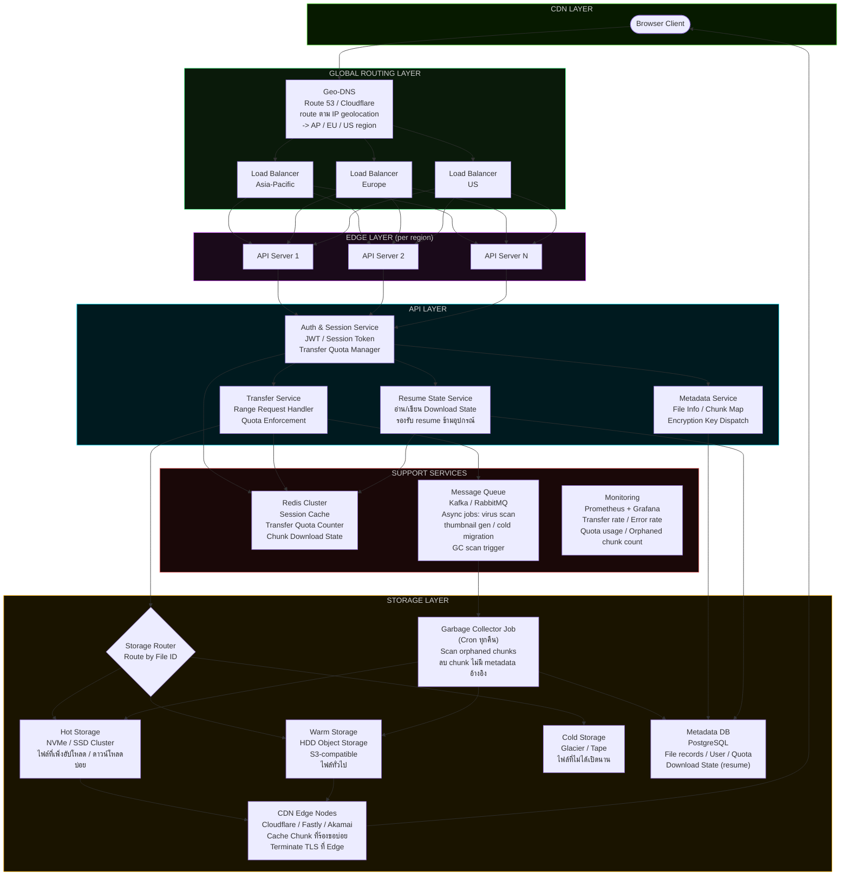

# Large-Scale File Transfer — Server Infrastructure

> สถาปัตยกรรมฝั่ง Server สำหรับระบบดาวน์โหลดไฟล์ขนาดใหญ่แบบ End-to-End Encrypted

---

## Overview Diagram



---

## Layer 0 — Geo-DNS (Global Traffic Management)

ก่อน traffic จะถึง Load Balancer ต้องถูก route ไปหา region ที่ถูกต้องก่อน

### ปัญหาที่แก้

ถ้าไม่มี Geo-DNS user ในเอเชียอาจถูก route ไปที่ API Server ในสหรัฐฯ ซึ่งทำให้ Phase 0 (ดึง Metadata) ช้าผิดปกติ แม้ว่า chunk จะมาจาก CDN ที่ใกล้ก็ตาม เพราะ Metadata request เป็น round-trip ที่ต้องรอ response ก่อน client จึงจะเริ่ม fetch chunk ได้ หน้าเว็บจะดูค้างตั้งแต่ต้น

### การทำงาน

```
DNS query: api.example.com
      |
  Route 53 / Cloudflare ตรวจ IP ของ client
      |
      |-- IP จาก Asia      -> api-ap.example.com  (Tokyo / Singapore)
      |-- IP จาก Europe    -> api-eu.example.com  (Amsterdam / Frankfurt)
      |-- IP จาก Americas  -> api-us.example.com  (Virginia / Oregon)
```

แต่ละ region มี API Server cluster, Redis, และ Read Replica ของ PostgreSQL เป็นของตัวเอง Metadata ถูก replicate ข้าม region แบบ async เพื่อให้ read latency ต่ำทุกที่

### Failover

ถ้า region หนึ่งล่ม Geo-DNS จะ failover ไปยัง region ที่ใกล้ถัดไปโดยอัตโนมัติ โดย health check ที่ DNS level ทุก 30 วินาที

```
api-ap.example.com ล่ม
      |
  DNS health check ตรวจพบ
      |
  Route traffic ไป api-us.example.com แทน
  (latency เพิ่มขึ้นแต่ service ยังทำงานได้)
```

---

## Layer 1 — Load Balancer

ทำหน้าที่เป็น single entry point รับ traffic ทั้งหมดก่อนกระจายไปยัง API Server

### L4 vs L7

| | L4 (TCP/UDP) | L7 (HTTP/HTTPS) |
|---|---|---|
| ทำงานที่ | Transport Layer | Application Layer |
| รู้จัก path/header | ไม่ | ใช่ |
| เหมาะกับ | latency ต่ำมาก | routing ยืดหยุ่น |
| ตัวอย่าง | HAProxy (TCP mode), AWS NLB | HAProxy (HTTP mode), AWS ALB, Nginx |

ระบบ file transfer ขนาดใหญ่มักใช้ **L7** เพราะต้องการ path-based routing เช่น `/api/*` ไป API Server และ `/dl/*` ไป Transfer Server โดยตรง

### กลยุทธ์ที่สำคัญ

**TLS Termination ที่ Load Balancer**
รับ HTTPS จาก client แล้วส่งต่อเป็น HTTP ภายใน internal network ลด overhead การ handshake ที่ API Server แต่ละตัว

**Sticky Session สำหรับ Transfer**
การดาวน์โหลดไฟล์เดียวกันควรถูก route ไปยัง API Server ตัวเดิมตลอด session เพื่อให้ Quota state ใน Redis ถูกอ่านจาก node เดิม ใช้ `ip_hash` หรือ cookie-based affinity

**Health Check**
ตรวจ API Server ทุก 5–10 วินาที ถ้า fail -> ตัดออกจาก pool ทันที โดยไม่รอ timeout จาก client

**Rate Limiting ที่ Edge**
จำกัด request per IP ก่อนถึง API Server เพื่อกัน DDoS และ quota abuse เบื้องต้น

---

## Layer 2 — API Server

ไม่ได้ส่งไฟล์โดยตรง หน้าที่หลักคือ orchestrate ทุก request

### Auth & Session Service

```
POST /auth/login
  -> ตรวจ credential
  -> ออก JWT (short-lived 15min) + Refresh Token (long-lived)
  -> เก็บ session state ใน Redis

GET /auth/refresh
  -> รับ Refresh Token -> ออก JWT ใหม่
  -> ถ้า Refresh Token หมดอายุ -> force re-login
```

**Transfer Quota Manager** ทำงานใน Service เดียวกัน

```
Redis key: quota:{ip}:{date}
  -> increment ทุกครั้งที่ส่ง chunk
  -> TTL = สิ้นสุดวัน (reset ทุกวัน)
  -> ถ้า value > QUOTA_LIMIT -> return 509 Bandwidth Limit Exceeded
```

### Metadata Service

```
GET /file/:id/meta
  -> ตรวจสิทธิ์ access
  -> คืน:
     {
       size: 1073741824,
       chunkSize: 16777216,
       totalChunks: 64,
       mimeType: "application/zip",
       macs: ["a3f9...", "9b2c...", ...],
       encryptedKey: "...",   <- encrypted ด้วย user's public key
       storageClass: "warm"
     }
```

key สำหรับ decrypt ไฟล์ถูกเข้ารหัสด้วย public key ของ user ก่อนเก็บ server ไม่มีทางรู้ plaintext key ของไฟล์ผู้ใช้ (Zero-Knowledge)

### Transfer Service

```
GET /dl/:fileId/:chunkIndex
  -> ตรวจ JWT
  -> เช็ค Quota Counter ใน Redis
  -> resolve storage path จาก Metadata DB
  -> ถ้าไฟล์อยู่ใน Hot/Warm -> redirect 302 ไปยัง CDN URL
  -> ถ้าไฟล์อยู่ใน Cold -> trigger restore job -> return 202 Accepted
```

API Server ไม่ proxy bytes ของไฟล์ผ่านตัวเอง แค่ออก signed URL แล้ว redirect ไปให้ CDN/Storage รับหน้าที่ส่งข้อมูลโดยตรง ลด bandwidth และ CPU บน API Server ได้มหาศาล

---

## Layer 3 — Storage Backend

### Storage Tiering

ไฟล์ไม่ได้เก็บในที่เดียวทั้งหมด แบ่งตาม access pattern เพื่อควบคุมต้นทุน

```
Hot Storage   -> NVMe / SSD Cluster
                 latency < 1ms
                 ราคาสูงสุด
                 เหมาะกับ: ไฟล์ที่เพิ่งอัปโหลด (< 24h)
                            ไฟล์ที่ถูกดาวน์โหลด > 100 ครั้ง/วัน

Warm Storage  -> HDD Object Storage (S3-compatible: Ceph, MinIO, AWS S3)
                 latency 10-50ms
                 ราคากลาง
                 เหมาะกับ: ไฟล์ทั่วไปที่ยังใช้งานอยู่

Cold Storage  -> AWS Glacier / Google Archive / Tape
                 latency หลายนาที - หลายชั่วโมง
                 ราคาถูกที่สุด
                 เหมาะกับ: ไฟล์ที่ไม่ได้เปิดนานกว่า 90 วัน
```

**Migration Policy** ทำงานผ่าน async job ใน Queue

```
ทุกคืน:
  - ไฟล์ไหนไม่ถูกเข้าถึง > 7 วัน  -> Hot -> Warm
  - ไฟล์ไหนไม่ถูกเข้าถึง > 90 วัน -> Warm -> Cold
  - ไฟล์ถูก access จาก Cold       -> restore -> Warm -> Hot
```

### Object Storage Design

แต่ละ chunk ถูกเก็บเป็น object แยก ไม่ใช่ไฟล์เดียวกัน

```
s3://file-storage/
  files/
    {fileId}/
      chunk_0      <- encrypted binary
      chunk_1
      ...
      chunk_63
  meta/
    {fileId}.json  <- metadata + mac list (ไม่มี key)
```

การเก็บแยก chunk มีข้อดีคือ สามารถ serve แต่ละ chunk ผ่าน CDN ได้โดยตรง, retry เฉพาะ chunk ที่เสียได้ และกระจาย load ของ read operation ไปหลาย object node

### Erasure Coding

แทนที่จะทำ simple replication (เก็บ 3 copies) ระบบขนาดใหญ่ใช้ **Erasure Coding** เช่น Reed-Solomon

```
RS(10, 4) หมายความว่า:
  - แบ่งข้อมูลเป็น 10 data shards
  - สร้าง 4 parity shards เพิ่ม
  - กระจายทั้ง 14 shards ไปยัง node ต่างกัน
  - node ล่มได้ถึง 4 node พร้อมกันโดยข้อมูลไม่สูญ
  - ใช้ storage เพิ่มแค่ 40% (vs replication ที่ใช้ 200%)
```

### Deduplication — Content-Addressable Storage (Optional)

สำหรับระบบที่มีผู้ใช้อัปโหลดไฟล์เดิมซ้ำกันจำนวนมาก เช่น ไฟล์ installer หรือ dataset สาธารณะ สามารถประหยัด storage ได้ด้วย CAS

**หลักการ**

แทนที่จะเก็บ chunk ตาม path `files/{fileId}/chunk_N` ให้เก็บตาม hash ของเนื้อหา

```
chunk content  ->  SHA-256  ->  "a3f9b2..."
storage path   ->  chunks/a3/f9b2...   (2 ตัวแรกเป็น prefix directory)

ถ้า hash ซ้ำ -> ไม่เขียน object ใหม่ แค่เพิ่ม reference count
```

PostgreSQL เก็บ mapping ระหว่าง `(fileId, chunkIndex)` กับ `chunkHash` แทน path โดยตรง

```sql
chunk_refs
  file_id      UUID FK
  chunk_index  INT
  chunk_hash   VARCHAR(64)   -- SHA-256 ของ encrypted chunk
  ref_count    INT           -- จำนวน file ที่อ้างอิง chunk นี้
  PRIMARY KEY (chunk_hash)
```

GC Job ปรับให้ลบ object ก็ต่อเมื่อ `ref_count = 0` เท่านั้น

**ข้อควรระวัง — Privacy**

CAS บน encrypted chunks มีความละเอียดอ่อนด้านความเป็นส่วนตัว

```
กรณีที่ปลอดภัย:
  user A และ user B อัปโหลดไฟล์เดียวกัน
  แต่เข้ารหัสด้วย key ต่างกัน
  -> ciphertext ต่างกัน -> hash ต่างกัน -> ไม่ได้ประโยชน์จาก dedup
  -> server ไม่รู้ว่าไฟล์เหมือนกัน (Zero-Knowledge ยังคงอยู่)

กรณีที่เสี่ยง (Convergent Encryption):
  ใช้ key ที่ derive จาก hash ของ plaintext เพื่อให้ได้ ciphertext เหมือนกัน
  -> dedup ได้จริง แต่เปิดช่องโหว่ "confirmation attack"
  -> ถ้า attacker รู้ว่าไฟล์คืออะไร สามารถ upload ไฟล์นั้นแล้วตรวจว่า hash ซ้ำไหม
  -> server จะรู้ว่า user มีไฟล์นั้นโดยไม่ต้อง decrypt
```

สำหรับระบบที่ให้ความสำคัญ Zero-Knowledge อย่างสมบูรณ์ ควรข้าม Deduplication หรือจำกัดให้ทำได้เฉพาะ public files ที่ user ประกาศเองเท่านั้น

---

## Layer 4 — CDN

CDN ทำหน้าที่ cache และส่ง chunk ให้ใกล้ user ที่สุด ลด latency และลด egress cost จาก origin

### Chunk Caching Strategy

```
Cache Key: /dl/{fileId}/{chunkIndex}

Cache-Control: public, max-age=86400, immutable
  -> chunk ของไฟล์ที่ encrypt แล้วไม่มีทางเปลี่ยน
  -> safe ที่จะ cache ได้นาน
  -> immutable บอก browser/CDN ว่าไม่ต้อง revalidate

หลัง file ถูกลบ:
  -> API ส่ง Cache-Tag purge request ไปยัง CDN
  -> CDN invalidate ทุก chunk ของ fileId นั้นพร้อมกัน
```

### Signed URL

CDN URL ทุกเส้นต้องมี signature ป้องกันการแชร์ link โดยไม่ได้รับอนุญาต

```
URL: https://cdn.example.com/dl/{fileId}/{chunkIndex}
       ?token={HMAC_SHA256(fileId+chunkIndex+userId+expiry, secret)}
       &expires={unix_timestamp}

ถ้า token ไม่ตรง -> CDN คืน 403
ถ้า expires ผ่านไปแล้ว -> CDN คืน 410
```

Token ถูกสร้างโดย API Server และแนบมาใน Metadata response ให้ client ใช้ได้เลย

### Edge Node Selection

CDN กระจาย edge node ไว้ทั่วโลก client จะถูก route ไปหา node ที่ใกล้ที่สุดโดยอัตโนมัติผ่าน **Anycast routing** ซึ่งหมายความว่า IP เดียวกันแต่ traffic จาก Tokyo ไปที่ Tokyo node และ traffic จาก London ไปที่ London node

---

## Support Services

### Redis Cluster

ใช้ Redis ในหลาย role พร้อมกัน

| Key Pattern | ใช้เก็บ | TTL |
|---|---|---|
| `session:{userId}` | Session state | 24h |
| `quota:{ip}:{date}` | Transfer quota counter | สิ้นสุดวัน |
| `dl_state:{fileId}:{userId}` | chunk download progress | 7 วัน |
| `file_meta:{fileId}` | Metadata cache | 1h |
| `signed_url:{token}` | Issued CDN tokens | ตาม expiry |

Redis Cluster แบบ 3-node minimum พร้อม replication เพื่อ HA

### Metadata Database (PostgreSQL)

```sql
files
  id           UUID PK
  owner_id     UUID FK
  size         BIGINT
  chunk_size   INT
  total_chunks INT
  storage_path TEXT
  storage_tier VARCHAR(10)  -- hot / warm / cold
  created_at   TIMESTAMP
  last_access  TIMESTAMP
  is_deleted   BOOLEAN

file_macs
  file_id      UUID FK
  chunk_index  INT
  mac_value    VARCHAR(32)

transfer_quota
  ip_address   INET
  date         DATE
  bytes_used   BIGINT
  PRIMARY KEY (ip_address, date)
```

### Message Queue (Kafka)

งาน async ที่ไม่ควรทำบน request cycle

```
Topics:
  file.uploaded      -> trigger: virus scan, thumbnail generation
  file.downloaded    -> trigger: update last_access, hot tier promotion
  file.idle          -> trigger: migrate Warm -> Cold
  file.deleted       -> trigger: CDN purge, storage cleanup
  quota.exceeded     -> trigger: notify user, log anomaly
  gc.scan.trigger    -> trigger: Garbage Collector Job (ทุกคืน)
  cdn.access.log     -> trigger: Security Analytics stream processor
  cdn.error.log      -> trigger: 4xx/5xx anomaly detection
  security.alert     -> trigger: IP block, token revoke
```

### Garbage Collector Job

ปัญหา Orphaned Chunks เกิดได้จากหลายสาเหตุ เช่น user ยกเลิกอัปโหลดกลางคัน, network ขาดระหว่างเขียน, หรือ Cleanup job ทำงานผิดพลาด ทำให้มี chunk อยู่ใน Object Storage แต่ไม่มี record ใน Metadata DB อ้างอิงถึง

```
GC Job ทำงานทุกคืน (low-traffic hours):

Step 1 — Snapshot
  อ่านรายการ fileId ทั้งหมดที่ valid จาก PostgreSQL
  เก็บเป็น Set ใน memory

Step 2 — Scan
  List objects ทั้งหมดใน Object Storage
  แต่ละ object path: files/{fileId}/chunk_{N}
  ดึง fileId ออกมาตรวจ

Step 3 — Diff
  ถ้า fileId ไม่อยู่ใน Set จาก Step 1
    -> ถือว่าเป็น Orphaned Chunk
    -> เพิ่มเข้า deletion queue

Step 4 — Delete (safe delete)
  รอ grace period 24h ก่อนลบจริง
  (ป้องกันกรณี object เพิ่งสร้างและ DB ยัง replicate ไม่ทัน)
  ลบ object จาก storage
  บันทึก log ว่าลบอะไรไปเท่าไร
```

**Grace Period** สำคัญมากสำหรับระบบ distributed เพราะ object อาจถูกสร้างใน storage ก่อนที่ transaction ใน PostgreSQL จะ commit เสร็จและ replicate ข้าม region ถ้าลบทันทีอาจลบ chunk ที่กำลังอัปโหลดอยู่ได้

Monitoring metric เพิ่มเติม: `orphaned_chunks_deleted_per_day` และ `orphaned_storage_reclaimed_bytes`

---

## Resume-ability ข้ามอุปกรณ์

ออกแบบให้รองรับไฟล์ขนาด 100GB+ ที่อาจใช้เวลาโหลดหลายชั่วโมง

### Download State Schema

เก็บสถานะไว้ทั้งฝั่ง Client (IndexedDB) และฝั่ง Server (PostgreSQL) เพื่อรองรับการ resume ข้ามอุปกรณ์

**Client — IndexedDB**

```js
// key: dl_state:{fileId}
{
  fileId:        "abc123",
  userId:        "user456",
  totalChunks:   6400,
  chunkSize:     16777216,
  completedChunks: [0, 1, 2, 5, 6],   // index ที่โหลดและ verify แล้ว
  startedAt:     1710000000000,
  lastUpdatedAt: 1710003600000
}
```

**Server — PostgreSQL**

```sql
download_sessions
  id              UUID PK
  user_id         UUID FK
  file_id         UUID FK
  total_chunks    INT
  completed_mask  BYTEA    -- bitmask ของ chunk ที่เสร็จแล้ว
  started_at      TIMESTAMP
  last_active_at  TIMESTAMP
  expires_at      TIMESTAMP  -- TTL 7 วัน ถ้าไม่ active ลบทิ้ง
```

ใช้ bitmask แทน array เพื่อประหยัดพื้นที่ ไฟล์ 6,400 chunks ใช้ bitmask แค่ 800 bytes

### Eventual Consistency — Hybrid Approach

ระบบ distributed มีความเสี่ยงที่ Read Replica ใน region ปลายทางยังไม่ sync ทัน ทำให้ Device ใหม่ query หา session แล้วไม่พบ การออกแบบนี้ใช้ **Hybrid ระหว่าง Resume Token และ Primary Fallback** เพื่อจัดการปัญหาดังกล่าว

```
Device A โหลดไปได้ 40% -> ระบบสร้าง Resume Token
                           (signed JWT บรรจุ fileId + bitmask + expiry)
                           แสดงเป็น QR Code หรือ share link
      |
      | User ย้ายไป Device B
      v

Happy Path (Token):
  Device B สแกน QR / กดลิงก์
  -> decode token -> ได้ completedChunks ทันที
  -> เริ่มโหลดได้เลยโดยไม่ต้อง query DB เลย
  -> Stateless, Zero-Knowledge, ไม่กระทบ DB load

Fallback Path (เข้าผ่าน URL ปกติ ไม่มี token):
  Device B query Read Replica
      |
      |-- พบ session  -> ใช้ได้เลย
      |
      |-- ไม่พบ (replica lag) -> retry ไปที่ Primary DB หนึ่งครั้ง
                                      |
                                      |-- พบ    -> ใช้ได้
                                      |-- ไม่พบ -> เริ่มโหลดใหม่ทั้งหมด
```

**เหตุผลที่ไม่ใช้ Synchronous Cross-Region Write**

การ write session ข้าม region แบบ synchronous เพิ่ม latency 100ms+ ทุกครั้งที่ user กดเริ่มโหลด ซึ่งกระทบ UX ในจุดที่ sensitive ที่สุด (first impression) โดยไม่จำเป็น เพราะ cross-device resume เป็น edge case ที่เกิดน้อยมากเมื่อเทียบกับ user ที่โหลดบนเครื่องเดียวจนจบ

### Resume Flow

```
เปิดหน้าเว็บขึ้นมาใหม่:

1. มี Resume Token หรือไม่?
   ใช่  -> decode token -> ได้ completedChunks ทันที (ข้ามไป step 4)
   ไม่  -> ไป step 2

2. อ่าน dl_state จาก IndexedDB ของ browser นี้
   พบ  -> ใช้ completedChunks จาก local (ข้ามไป step 4)
   ไม่พบ -> ไป step 3

3. GET /file/:id/resume-state จาก Read Replica
   พบ  -> ใช้ได้เลย
   ไม่พบ -> retry ไป Primary DB
     พบ  -> ใช้ได้เลย
     ไม่พบ -> completedChunks = [] (เริ่มใหม่)

4. สร้าง Chunk Queue เฉพาะ chunk ที่ยังไม่อยู่ใน completedChunks
5. เริ่ม fetch -> Queue Manager ตามปกติ

ระหว่างโหลด:
  ทุกครั้งที่ chunk ผ่าน MAC verify -> บันทึกลง IndexedDB ทันที
  ทุก 30 วินาที -> sync completedChunks ขึ้น Server (debounced)
```

chunk ที่โหลดแล้วบน Device A ยังอยู่ใน Object Storage เดิม Device B ดึงได้จาก CDN ตามปกติ สิ่งที่ sync คือเพียง state ว่า chunk ไหนเสร็จแล้ว ไม่ใช่ตัวข้อมูล

---

### CDN Log Analysis & Security Analytics

CDN Log ที่ Cloudflare / Fastly สร้างทุก request เป็น source ข้อมูลที่มีคุณค่าสำหรับ Security Analytics ระบบออกแบบเป็น **สองชั้น** เพื่อจัดการกับ CDN log latency ที่มาแบบ batch ทุก 10-30 วินาที

**ชั้นที่ 1 — Edge Rate Limiter (First Line of Defense)**

ทำงานที่ Cloudflare WAF หรือ Load Balancer โดยตรง ไม่รอ log วิเคราะห์ ตอบสนองทันทีในระดับ millisecond

```
Rules ที่ตั้งไว้:
  403 > 20 ครั้ง / 60s / IP   -> auto-block 5 นาที
  req > 200 ครั้ง / 10s / IP  -> rate limit (429)
  token missing / malformed   -> block ทันที (400)
```

ครอบคลุม threat ที่ตรวจง่ายและอันตรายที่สุดคือ Bruteforce และ Bandwidth Drain ซึ่งถ้าปล่อยให้ทำงานได้ถึง 60 วินาทีอาจสูญเสีย bandwidth ไปหลาย GB

**ชั้นที่ 2 — Flink Stream Processor (The Brain)**

รับ log batch จาก CDN เข้า Kafka แล้ว process เพื่อตรวจจับ pattern ที่ซับซ้อน ซึ่ง rate limiter ปกติตรวจจับไม่ได้ ยอมรับ detection delay 30-60 วินาทีได้เพราะชั้นแรกรับ immediate threat ไปแล้ว

```
Pattern ที่ Flink ตรวจจับ:

Low-and-Slow Attack:
  5 req/min จาก 200 IP ที่ต่างกัน -> ไม่โดน rate limit แต่รวมแล้ว 1,000 req/min
  Flink ตรวจด้วย sliding window 10 นาที + IP correlation
  -> cluster IP ที่ทำ pattern คล้ายกัน -> block subnet

Token Replay Attack:
  token เดิมถูกใช้จาก 2 IP ต่างกันใน 60 วินาที
  -> revoke token ใน Redis -> force re-auth

Enumeration Attack:
  fileId pattern sequential จาก IP เดียว
  -> rate limit + alert

404 Spike (Storage Health):
  404 Not Found พุ่งขึ้นผิดปกติใน region ใด region หนึ่ง
  -> อาจเป็น GC ลบ chunk ที่ยังมีคนโหลดอยู่ -> trigger investigation
```

**Log Pipeline**

```
CDN Edge Node
      |
      | batch log (10-30s)
      v
Kafka: cdn.access.log / cdn.error.log
      |
      |-- Edge Rate Limiter (ทำงานอิสระ ไม่ต้องรอ pipeline นี้)
      |
      |-- Flink Sliding Window (5-10 นาที)
      |       ตรวจ sophisticated patterns
      |       -> publish: security.alert / security.ip.block
      |
      |-- Log Storage (S3 + Parquet)
              historical analysis / audit trail
```

**Flink Window Threshold**

ตั้ง sliding window กว้างกว่า batch interval เสมอเพื่อป้องกัน false positive

```
CDN batch ทุก 30s
  -> ไม่ใช้ window 1 นาที (batch แรกมาอาจดูเหมือน spike)
  -> ใช้ sliding window 5-10 นาที แทน
  -> นับ unique IP + request count + status distribution รวมกัน
```

**Kafka Topics**

```
cdn.access.log         -> raw log ทุก request จาก CDN
cdn.error.log          -> เฉพาะ 4xx / 5xx
security.alert         -> IP / pattern ที่ถูก flag
security.ip.block      -> IP ที่ต้อง block ที่ Load Balancer
```

**Redis Blacklist**

```
Redis key: blacklist:token:{token}  TTL = token expiry
Redis key: blacklist:ip:{ip}        TTL = 1h (auto-unblock)
```

Load Balancer poll blacklist ทุก 30 วินาที สำหรับ IP ที่ Flink ตรวจพบ ส่วน Edge Rate Limiter ทำงานอิสระไม่รอ blacklist นี้

### Monitoring

```
Metrics ที่สำคัญ:

Transfer rate              -> MB/s per region
Chunk error rate           -> % chunk ที่ต้อง retry
Quota hit rate             -> % IP ที่โดน throttle
CDN hit ratio              -> % chunk ที่ serve จาก cache (เป้าหมาย > 80%)
Storage tier dist          -> % ข้อมูลใน hot/warm/cold
API p99 latency            -> latency ที่ percentile 99
Security 403 rate per IP   -> ตรวจจับ bruteforce
Orphaned chunks per day    -> ตรวจสุขภาพ GC job
```

Alert ถ้า CDN hit ratio ต่ำกว่า 70%, chunk error rate สูงกว่า 1%, หรือ 403 rate ของ IP ใดเกิน threshold

---

## Request Flow แบบสมบูรณ์

ตั้งแต่ client กด download จนได้ข้อมูล chunk แรก

```
1. Client     ->  POST /auth/login
                      Load Balancer route ไป API Server
                      Auth Service ตรวจ credential
                      ออก JWT + เก็บ session ใน Redis
               <-  { jwt, refreshToken }

2. Client     ->  GET /file/:id/meta  (พร้อม JWT)
                      Metadata Service ตรวจสิทธิ์
                      อ่าน cache จาก Redis ก่อน
                      ถ้า miss -> query PostgreSQL
                      สร้าง signed URLs สำหรับทุก chunk
               <-  { size, macs[], signedUrls[] }

3. Client     ->  GET cdn.example.com/dl/:fileId/0?token=...
                      CDN ตรวจ token signature
                      ถ้า cache hit  -> ส่ง chunk จาก edge ทันที
                      ถ้า cache miss -> CDN ดึงจาก Origin (Storage)
                                     -> cache ไว้สำหรับ request ถัดไป
               <-  encrypted chunk bytes (Range response)

4. (parallel)     ทำซ้ำ step 3 สำหรับ chunk 1..N พร้อมกัน
                  ผ่าน Queue Manager ฝั่ง Client

5. Client decrypt + verify MAC ทุก chunk -> assemble -> save
```

---

## สรุปหน้าที่แต่ละ Component

| Component | หน้าที่หลัก | Scale แบบ |
|---|---|---|
| Geo-DNS | Route user ไป region ที่ใกล้ที่สุด, Failover ข้าม region | Anycast DNS |
| Load Balancer | กระจาย traffic, TLS termination, rate limit | Active-Passive หรือ Active-Active |
| API Server | Auth, Metadata, Quota, ออก Signed URL | Horizontal (stateless) |
| Resume State Service | อ่าน/เขียน download progress, รองรับ resume ข้ามอุปกรณ์ | Horizontal |
| Redis | Session, Quota counter, Cache, Download state, IP/Token blacklist | Cluster 3+ nodes |
| PostgreSQL | File metadata, User, Quota, Download sessions, CAS chunk refs | Primary + Read Replicas per region |
| Object Storage | เก็บ encrypted chunks, รองรับ CAS path scheme | Distributed, Erasure Coded |
| Garbage Collector | ลบ orphaned chunks ที่ไม่มี metadata อ้างอิง | Cron job, ทำงาน off-peak |
| CDN | Cache chunks, ลด latency, ลด Origin load | Anycast, Global Edge |
| CDN Log Pipeline | Stream log เข้า Kafka, ตรวจ security pattern real-time | Kafka + Flink/Kafka Streams |
| Kafka | Async jobs (scan, migrate, purge, GC, security events) | Cluster, Partitioned by fileId |
| Monitoring | Observability, Alert รวม security metrics | Prometheus + Grafana |

---

## Zero-Knowledge Design

หลักการสำคัญของสถาปัตยกรรมนี้ คือ server ต้องไม่สามารถอ่านข้อมูลของ user ได้

```
อัปโหลด:
  Client encrypt file ด้วย random File Key (AES)
  File Key ถูก encrypt ด้วย User's Master Key
  ส่งเฉพาะ ciphertext ขึ้น server

ดาวน์โหลด:
  Server ส่ง encrypted File Key กลับมา
  Client decrypt File Key ด้วย Master Key ที่อยู่ใน browser เท่านั้น
  Client ใช้ File Key decrypt chunks

Server รู้แค่:
  - ขนาดไฟล์
  - เวลาอัปโหลด
  - ใครเป็นเจ้าของ
  - MAC ของแต่ละ chunk (ยังไม่พอ decrypt ได้)

Server ไม่รู้:
  - เนื้อหาในไฟล์
  - File Key
  - Master Key ของ user
```

---

## Architecture Decision Records (ADR)

บันทึกการตัดสินใจออกแบบที่สำคัญ เพื่อให้ทีมเข้าใจเหตุผลเบื้องหลังและไม่ย้อนกลับไปถกเดิมในอนาคต

---

### ADR-001 — Session Consistency Strategy

**Status:** Accepted

**Context:**
ระบบ multi-region มี Read Replica ใน AP / EU / US ซึ่งมี replication lag ประมาณ 100-500ms ทำให้การ query Download Session จาก region ใหม่อาจไม่พบข้อมูลทันที โดยเฉพาะกรณี cross-device resume

**Decision:**
ใช้ Eventual Consistency พร้อม Hybrid Fallback ดังนี้

1. Resume Token (Primary): signed JWT ที่ encode bitmask ไว้ใน token เอง device ใหม่ใช้ได้ทันทีโดยไม่ต้อง query DB
2. Primary DB Fallback (Safety Net): ถ้าเข้าผ่าน URL ปกติแล้ว Read Replica ไม่พบ session ให้ retry ไปที่ Primary DB หนึ่งครั้งก่อนแจ้ง error

**Rejected Alternative:**
Synchronous cross-region write เพิ่ม write latency 100ms+ ทุก session start ซึ่งกระทบ UX ในจุดที่ user รู้สึกมากที่สุด (การกดเริ่มโหลดครั้งแรก) โดยไม่จำเป็น เพราะ cross-device resume เป็น edge case ที่เกิดน้อย

**Consequences:**
- Write latency ต่ำ ไม่กระทบ initial start
- cross-device resume ผ่าน token ทำได้ทันที
- กรณีไม่มี token และ Primary Fallback ก็ไม่พบ: user ต้องโหลดใหม่ทั้งหมด (ยอมรับได้)

---

### ADR-002 — Threat Detection Architecture

**Status:** Accepted

**Context:**
CDN Log มาแบบ batch ทุก 10-30 วินาที ทำให้ detection delay สูงถึง 30-60 วินาที ในระบบ file transfer หาก attack ทำงานได้ 60 วินาทีอาจสูญเสีย bandwidth หลาย GB

**Decision:**
แบ่ง threat detection เป็นสองชั้น

1. Edge Rate Limiter (Cloudflare WAF / Load Balancer): จัดการ immediate threats เช่น bruteforce และ bandwidth drain โดยตรงที่ edge ไม่รอ log pipeline ตอบสนองใน millisecond
2. Flink Stream Processor: รับ batch log จาก Kafka วิเคราะห์ sophisticated patterns เช่น low-and-slow attack และ cross-IP correlation ยอมรับ detection delay 30-60 วินาทีได้เพราะ immediate threats ถูกชั้นแรกจัดการแล้ว

**Flink Window:**
ใช้ sliding window 5-10 นาที เพื่อป้องกัน false positive จาก batch spike ไม่ใช้ window 1 นาที ซึ่งแคบเกินไปสำหรับ batch interval 30 วินาที

**Consequences:**
- Immediate threats ถูกบล็อกใน millisecond
- Sophisticated patterns ตรวจได้ใน 30-60 วินาที ซึ่งยอมรับได้
- Flink ต้องการ tuning threshold อย่างสม่ำเสมอเพื่อลด false positive
